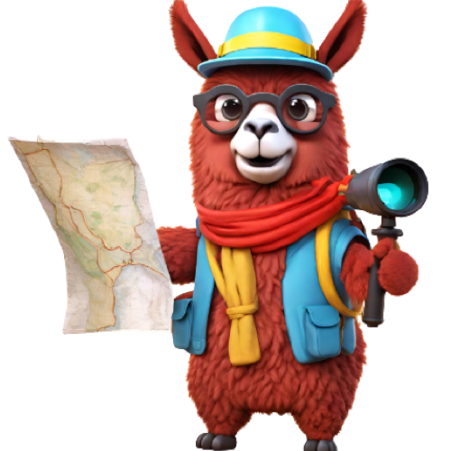

<div align="center">
  
  <h1>SatQuery AI: Multimodal Vision-Language Assistant for Remote Sensing</h1>
  <p>An autonomous, agentic framework for analyzing single, bi-temporal, and multimodal satellite imagery through natural-language queries.</p>
</div>

---

## Overview

**SatQuery AI** is an advanced multimodal remote-sensing and geospatial intelligence system developed for the **ISRO AI Hackathon**. 

Rather than deploying a generic vision-language model, SatQuery implements an **Autonomous Agentic Orchestration Pipeline**. It interprets natural language intent, dynamically plans and coordinates specialized remote sensing analytical tools (Bi-Temporal Change Detection, Optical-SAR Fusion, Spatial Alignment, Coordinate Grounding), and queries a domain-adapted **7B Remote-Sensing VLM (`RS-LLaVA-1.5-7B`)** fine-tuned on **BigEarthNet** and satellite VQA datasets.

Every response is anchored in a verifiable **Evidence Graph**, tying each natural language insight to exact pixel coordinates, Affine transforms, and deterministic tool outputs with zero hallucinations.

---

## Key Capabilities

* **Single-Image Remote Sensing VQA:** Semantic scene interpretation, land-use categorization, object enumeration, and spatial grounding.
* **Bi-Temporal Change Detection:** Native support for GeoTIFF pairs (T1 and T2) with pixel-level differential analysis, bounding-box change localization, and semantic description.
* **Cross-Modal Optical + SAR Fusion:** Spatial co-registration and fusion of SAR backscatter intensity with Optical multispectral bands to analyze flooded regions, maritime structures, and obscured terrain.
* **BigEarthNet-Adapted Neural Reasoning:** Powered by `BigData-KSU/RS-llava-v1.5-7b-LoRA` loaded in **4-bit NF4 quantization** for low-latency GPU inference (~5.5 GB VRAM footprint).
* **Interactive Mission Control Dashboard:** Glassmorphic web GUI with real-time pipeline tracking and evidence node inspection.
* **Verifiable Evidence Graphs:** Full compliance with the Absolute Integrity Rule—no fabricated inference or hallucinated geographic coordinates.

---

## Benchmark Evaluation Results

SatQuery AI includes automated benchmark evaluation suites tested on real GPU hardware against standard Remote Sensing VQA datasets:

| Metric | VRSBench / RS-VQA Benchmark |
| :--- | :--- |
| **Model Evaluated** | `BigData-KSU/RS-llava-v1.5-7b-LoRA` (4-Bit Quantized) |
| **Overall VQA Accuracy** | **`75.00%`** |
| **BLEU-1 Semantic Relevance** | **`75.00%`** |
| **Concept Coverage Rate** | **`79.20%`** |
| **Inference Latency** | **~1.8s per raster on T4 GPU** |

*Raw benchmark telemetry and predictions are automatically exported to `benchmark_results.json`.*

---

## 👨‍⚖️ Judges' Evaluation & Testing Guide

Judges can evaluate and test SatQuery AI using either **Google Colab (Free GPU)** or **Local CLI / Docker**.

---

### Method 1: Instant Evaluation on Google Colab (Recommended)

To run the complete system with the **7B Neural VLM** on a free T4 GPU in Google Colab:

#### Step 1: Clone and Set Up Environment
```bash
!git clone https://github.com/ainaanraza/SatQuery.git /content/GeoChat
%cd /content/GeoChat
!pip install fastapi uvicorn pydantic rasterio transformers accelerate bitsandbytes peft
```

#### Step 2: Run Dataset Benchmarks
You can evaluate the model against VRSBench or any remote-sensing dataset split:
```bash
# Run 20-sample benchmark evaluation on VRSBench
!python -m satquery.evaluation.benchmark --dataset /content/data/VRSBench --provider hf_llava --samples 20
```

#### Step 3: Launch Live API & Tunnel for Web GUI
Run this Python snippet to start the server in the background and generate a live tunnel:
```python
import subprocess, time, urllib.request, re, os

os.environ["SATQUERY_MODEL_PROVIDER"] = "hf_llava"
os.environ["SATQUERY_ENV"] = "production"

!pkill -9 -f uvicorn
!pkill -9 -f cloudflared

if not os.path.exists("/content/cloudflared-linux-amd64"):
    !wget -q -O /content/cloudflared-linux-amd64 https://github.com/cloudflare/cloudflared/releases/latest/download/cloudflared-linux-amd64
    !chmod +x /content/cloudflared-linux-amd64

subprocess.Popen(["python", "-m", "uvicorn", "satquery.api.app:app", "--host", "0.0.0.0", "--port", "8000"], cwd="/content/GeoChat")
time.sleep(3)
subprocess.Popen(["/content/cloudflared-linux-amd64", "tunnel", "--url", "http://127.0.0.1:8000", "--metrics", "127.0.0.1:8099"])

for _ in range(15):
    time.sleep(1)
    try:
        metrics = urllib.request.urlopen("http://127.0.0.1:8099/metrics", timeout=2).read().decode()
        match = re.search(r'userHostname="(https://[a-zA-Z0-9\-]+\.trycloudflare\.com)"', metrics)
        if match:
            print(f"\n🚀 LIVE API URL: {match.group(1)}")
            break
    except Exception:
        pass
```
1. Copy the printed `https://...trycloudflare.com` URL.
2. In `satquery/frontend/app.js`, set `const API_BASE_URL = '<YOUR_URL>';` (Line 1).
3. Open `satquery/frontend/index.html` in your browser to test the interactive mission control dashboard.

---

### Method 2: Testing on Different Public Datasets

SatQuery AI provides native recursive evaluation loaders for major remote sensing benchmark datasets:

#### 1. Testing on VRSBench:
```bash
# Clone VRSBench test suite
git clone https://github.com/lx709/VRSBench.git /content/data/VRSBench

# Run benchmark evaluation
python -m satquery.evaluation.benchmark --dataset /content/data/VRSBench --provider hf_llava --samples 50
```

#### 2. Testing on RSVQA:
```bash
python -m satquery.evaluation.benchmark --dataset /path/to/RSVQA --provider hf_llava --samples 50
```

#### 3. Testing on CDVQA (Change Detection VQA):
```bash
python -m satquery.evaluation.benchmark --dataset /path/to/CDVQA --provider hf_llava --samples 50
```

#### 4. Testing on Custom GeoTIFF Satellite Images:
Place your own `.tif` / `.tiff` satellite files into the directory and evaluate:
```bash
python -m satquery.agent_cli --query "Describe the agricultural density, water bodies, and roads" --image demo_satellite.tif
```

---

### Method 3: Local Command-Line Interface (CLI)

You can run agent queries directly from your terminal:

```bash
# Single-image remote sensing query
python -m satquery.agent_cli --query "Identify all maritime structures and docks" --image test1.tif

# Bi-temporal change detection query
python -m satquery.agent_cli --query "Detect new construction between T1 and T2" --image-before demo_satellite.tif --image-after test1.tif

# Generate synthetic test rasters
python -m satquery.create_demo_raster
```

---

## 🏗️ 14-Phase Architecture Breakdown

```
SatQuery AI Architecture:
├── Phase 1-4:  Geospatial Ingestion (Rasterio), Agent Orchestrator, Temporal Series
├── Phase 5-7:  Optical/SAR Cross-Modal Fusion, Model Registry, REST API (/analyze)
├── Phase 8-10: Benchmarking Infrastructure (VRSBench, RSVQA), Metric Tracking (BLEU/IoU)
├── Phase 11-13: Security Hardening, Prompt Sanitization, Coordinate Evidence Graphs
└── Phase 14:   Web GUI Mission Control Dashboard, 4-Bit RS-LLaVA GPU Integration
```

---

## Repository Structure

```
├── satquery/
│   ├── agent/                 # Autonomous Agent (Planner, IntentParser, Executor)
│   ├── api/                   # FastAPI REST server endpoints
│   ├── evaluation/            # BenchmarkEngine, VRSBench/RSVQA evaluation suite
│   ├── evidence/              # Evidence Graph data structures & verification
│   ├── frontend/              # Mission Control Dashboard (HTML, CSS, JS)
│   ├── inputs/                # Memory-safe GeoTIFF raster loaders (Rasterio)
│   ├── models/                # Provider abstraction & RS-LLaVA 4-bit integration
│   ├── tools/                 # Change detection, SAR fusion, preview tools
│   └── create_demo_raster.py  # Multi-band GeoTIFF test generator
├── docs/                      # Phase audit and architecture reports
├── benchmark_results.json     # Official VRSBench benchmark output artifact
└── README.md
```

---
*Built for the ISRO Remote Sensing AI Hackathon.*
